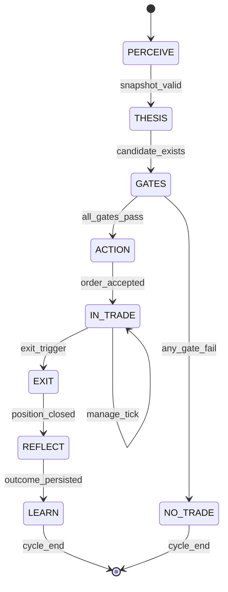

# Expert Decision Behavior Framework

**Mục đích:** Spec triển khai để hệ thống **mô phỏng có kiểm soát** hành vi quyết định của trader giỏi — không thay thế phán đoán con người, nhưng **bắt buộc** tách biệt: *biết gì* → *quyết định gì* → *học gì* → *được phép sửa đến đâu*.

**Phạm vi:** Áp dụng cho `trading-lab-pro-v3` và mọi bản fork tuân envelope + governance dưới đây.

---

## Phân biệt bốn lớp (áp dụng cho mọi mục trong file)

| Lớp | Nghĩa vận hành | Ví dụ tối thiểu phải có trong log/DB |
|-----|----------------|--------------------------------------|
| **Knows (biết)** | Dữ liệu đo được, snapshot, feature, quote — **không** chứa ý chí trade | `MarketContextSnapshot`, `klines`, `funding_rate`, `mfe_pct` |
| **Decides (quyết định)** | Ánh xạ từ biết → hành động có **điều kiện** và **lý do có cấu trúc** | `TradeDecision`, `management_state`, `reason_code` |
| **Learns (học)** | So sánh dự kiến vs kết quả + gán nhãn nguyên nhân + **artifact** lưu trữ | `OutcomeRecord`, `loss_category`, `lesson_summary` |
| **May self-change (được sửa)** | Chỉ qua **Learning governance** §4 — có proposal, ngưỡng, approve, version | `ConfigProposal` trạng thái `approved` mới áp dụng runtime |

---

## 1. Decision lifecycle

### 1.1. Sơ đồ trạng thái tổng thể

### 1.2. Bảng chi tiết từng bước

Mỗi bước: **Input** (Knows), **Output** (Decides + artifact), **Điều kiện chuyển trạng thái**, **Persist bắt buộc**.

#### Bước A — Market perception

| Thuộc tính | Nội dung |
|------------|----------|
| **Knows** | Raw: quotes (price, 24h%, volume 24h), OHLCV đa khung (ít nhất 1h + 4h), optional: funding, OI, BTC/ETH snapshot cùng timestamp cycle. Derived: ATR estimate, rel_volume, `regime_token_raw`, `regime_market_raw` (rule-based). |
| **Decides** | **Không** quyết định trade ở bước này; chỉ đánh dấu `snapshot_quality`: `ok` \| `degraded` \| `stale` (thiếu nến / quote cũ). |
| **Chuyển trạng thái** | → **THESIS** nếu `snapshot_quality ∈ {ok, degraded}` và có ít nhất một `symbol` trong watchlist. → Dừng sớm (log `NO_DATA`) nếu `stale` hoặc watchlist rỗng. |
| **Persist** | Bản ghi `market_context_snapshots`: `cycle_id`, `ts_utc`, `symbol`, JSON `inputs_raw`, JSON `features_derived`, `snapshot_quality`, `data_fingerprint` (hash nguồn để audit). |

#### Bước B — Thesis (cơ hội + hướng)

| Thuộc tính | Nội dung |
|------------|----------|
| **Knows** | Output bước A + output strategies (`StrategySignal` hoặc tương đương). |
| **Decides** | `thesis`: `{ direction, setup_type, primary_timeframe, entry_hypothesis, invalidation_rule }` — **invalidation_rule** phải là predicate có thể evaluate (vd. “close 1h dưới X”, “BTC regime_market = risk_off”). |
| **Chuyển trạng thái** | → **GATES** nếu có ít nhất một candidate với `thesis.direction ≠ flat`. → **NO_TRADE** với `no_trade_reason = NO_CANDIDATE` nếu không có signal. |
| **Persist** | `thesis_candidates`: `cycle_id`, `symbol`, `strategy_name`, JSON `thesis`, `signal_native` (slice có cấu trúc), `rank_clarity` (số), `rank_edge` (số) nếu đã có scoring. |

#### Bước C — Gates (lọc trước risk)

| Thuộc tính | Nội dung |
|------------|----------|
| **Knows** | Thesis + portfolio state (open positions, bucket limits), `MarketContextSnapshot`, rule config (context gates, timing, combo, correlation, regime-strategy map). |
| **Decides** | Cho từng candidate: `gate_results[]` mỗi phần tử `{ gate_id, pass: bool, reason_code }`. Quyết định tổng: `ENTER_ELIGIBLE` \| `WAIT` \| `REJECT`. |
| **Chuyển trạng thái** | → **ACTION** nếu `ENTER_ELIGIBLE` và risk approve. → **NO_TRADE** nếu `REJECT`. → **WAIT** (không gửi lệnh, lưu queue) nếu thiếu xác nhận theo config (vd. `NEED_CONFIRMATION_NEXT_BAR`). |
| **Persist** | `decision_events`: `event_type = pre_entry_evaluation`, JSON đầy đủ `gate_results`, `final_eligibility`, liên kết `thesis_candidate_id`. |

#### Bước D — Action (vào lệnh / scale-in)

| Thuộc tính | Nội dung |
|------------|----------|
| **Knows** | `RiskDecision` (size, cap), execution constraints (min notional, hedge mode). |
| **Decides** | `TradeDecision` envelope (xem roadmap): `entry_plan` (market/limit, max_slippage_bps), `stop_plan`, `tp_plan`, `manage_plan` (tần suất review, partial rules id), `size_usd`, `risk_usd`. |
| **Chuyển trạng thái** | → **IN_TRADE** nếu broker/paper chấp nhận và `position_id` tạo được. → **NO_TRADE** với `execution_error` nếu từ chối sàn. |
| **Persist** | `positions` + `trades` (open); `decision_events` `event_type = entry_executed` với `trade_decision_json`, `position_id`, `broker_order_ids`. |

#### Bước E — In-trade management

| Thuộc tính | Nội dung |
|------------|----------|
| **Knows** | Giá hiện tại, nến sau entry, MFE/MAE running, `invalidation_rule` từ envelope, portfolio exposure, `regime_*` cập nhật mỗi cycle. |
| **Decides** | `management_state` (§3 + bảng dưới) → một trong: `HOLD`, `MOVE_SL`, `PARTIAL_TP`, `REDUCE`, `SCALE_IN`, `FULL_EXIT`, `HEDGE_PARTIAL`. Mỗi lần đổi phải có `reason_code`. |
| **Chuyển trạng thái** | Vẫn **IN_TRADE** cho đến khi `FULL_EXIT` hoặc đồng bộ đóng từ sàn. |
| **Persist** | `position_management_log`: `position_id`, `ts_utc`, `management_state`, `reason_code`, `metrics_snapshot` (MFE, MAE, R unrealized, dist_to_tp). |

#### Bước F — Exit

| Thuộc tính | Nội dung |
|------------|----------|
| **Knows** | Giá thoát, fill qty, fee, `exit_trigger`: SL \| TP \| proactive \| sync \| manual. |
| **Decides** | Gắn `exit_class` tạm thời (sẽ tinh chỉnh ở REFLECT): `planned` vs `early` vs `forced`. |
| **Chuyển trạng thái** | → **REFLECT** khi `position.is_open = false` và trade close ghi nhận. |
| **Persist** | `trades` close row; cập nhật `positions.closed_at`; `decision_events` `event_type = exit`. |

#### Bước G — Reflection

| Thuộc tính | Nội dung |
|------------|----------|
| **Knows** | Toàn bộ chuỗi: snapshot lúc vào, envelope, log quản trị, outcome PnL, R, hold time, MFE/MAE final. |
| **Decides** | Gán `loss_category` hoặc `win_tag` (§2, §3); `thesis_verdict`: `validated` \| `invalidated` \| `inconclusive`. **Không** sửa config ở bước này. |
| **Chuyển trạng thái** | → **LEARN** sau khi `OutcomeRecord` ghi đủ field bắt buộc (§4). |
| **Persist** | `journal_entries` hoặc `outcome_records` với link `entry_decision_id`, `exit_decision_id`. |

#### Bước H — Learning (artifact)

| Thuộc tính | Nội dung |
|------------|----------|
| **Knows** | Outcome đã gán nhãn. |
| **Decides** | Chỉ quyết định **có tạo `ConfigProposal` hay không** theo §4 — không áp dụng trực tiếp. |
| **Chuyển trạng thái** | Kết thúc cycle; proposal vào queue nếu đủ điều kiện §4.3. |
| **Persist** | `learning_artifacts`: `outcome_id`, `lesson_type`, `proposal_id` (nullable), `auto_apply_eligible: bool` (luôn `false` trừ sandbox). |

---

### 1.3. ID và liên kết bắt buộc (để chứng minh “hiểu hành vi”)

- Mọi vòng đời phải truy vết: `cycle_id` → `thesis_candidate_id` → `entry_decision_id` → `position_id` → `outcome_id`.
- Nếu thiếu một mắt xích, báo cáo “expert behavior” **không hợp lệ** cho lệnh đó.

---

## 2. Loss handling framework

### 2.1. Tổng quan

**Knows:** PnL, R, MFE/MAE, thời gian giữ, log gate lúc vào, regime trước/sau, execution slippage vs kỳ vọng.  
**Decides:** Phân loại `loss_category` (một primary + optional `secondary_tags[]`).  
**Learns:** `lesson_summary` + có/không `ConfigProposal` theo cột cuối.  
**May self-change:** Chỉ khi cột “Proposal config” = **Có** *và* proposal vượt §4.3 *và* human approve (production).

### 2.2. Bảng phân loại thua lỗ

#### L1 — `thesis_wrong`

| Khía cạnh | Nội dung |
|------------|----------|
| **Dấu hiệu nhận biết** | Giá đi **ngược thesis có cấu trúc** trước khi chạm SL kỹ thuật: invalidation rule kích hoạt; hoặc MFE thấp + đóng do proactive với `thesis_verdict = invalidated`. Post-trade: setup_type lặp lại cùng hướng vẫn thua trên mẫu N. |
| **Hành động tức thời** | **FULL_EXIT** hoặc đã exit rồi thì không mở lại cùng thesis trên symbol đó trong `cooldown_thesis_hours` (config). Không scale-in. |
| **Bài học rút ra** | “Edge của setup này trên (strategy, regime, symbol class) bị overestimate.” Ghi vào journal: điều kiện thị trường cụ thể. |
| **Proposal config** | **Có**: giảm `strategy_weight` hoặc combo multiplier cho `(strategy, regime_token, side)`; hoặc tighten entry gate cho `setup_type` đó. |

#### L2 — `timing_wrong`

| Khía cạnh | Nội dung |
|------------|----------|
| **Dấu hiệu** | MFE đạt **đủ** ngưỡng “đúng hướng ngắn hạn” nhưng **không** đạt TP; sau đó revert và SL/proactive. Hoặc entry ngay trước spike ngược (detect: nến 1h wick lớn ngay sau entry). |
| **Hành động tức thời** | Nếu vẫn mở: **PARTIAL_TP** hoặc **MOVE_SL** theo `manage_plan` nếu đã có lãi nhỏ; nếu đã cắt: áp `WAIT` cho re-entry cùng symbol **ít nhất** `timing_cooldown_bars`. |
| **Bài học** | “Cần xác nhận thêm khung nhỏ / chờ pullback” — ghi `entry_timing_violation: true`. |
| **Proposal config** | **Có**: tăng strictness `entry_timing` hoặc `entry_context_gates`; thêm `NEED_CONFIRMATION` cho khung đó. |

#### L3 — `noise_volatility`

| Khía cạnh | Nội dung |
|------------|----------|
| **Dấu hiệu** | Stop bị **quét** trong biên dao động cao, sau đó giá quay về hướng thesis trong cửa sổ T giờ; hoặc `volatility_tier ∈ {high, extreme}` và hold time < `min_hold_for_vol_tier`. MFE/MAE dao động lớn với net R âm nhỏ. |
| **Hành động tức thời** | Không mở thêm; xét **widen stop chỉ trước khi vào** (không widen vô hạn trong lệnh). Sau exit: **không** đánh giá thesis `invalidated` chỉ vì SL noise — dùng `thesis_verdict = inconclusive`. |
| **Bài học** | “Size hoặc stop không phù hợp vol”; hoặc “nên skip symbol tier này”. |
| **Proposal config** | **Có**: tăng `min_signal_score_to_scale_in`, giảm max risk % cho `volatility_tier`; hoặc bật widen ATR cap cho tier (chỉ proposal, không tự động). |

#### L4 — `regime_shift`

| Khía cạnh | Nội dung |
|------------|----------|
| **Dấu hiệu** | `regime_market` hoặc `regime_token` **đổi class** (theo enum nội bộ) trong khi mở lệch với giả định lúc vào; BTC flip mạnh trong 1–2 nến 4h; funding đổi cực đoan nếu đã ingest. |
| **Hành động tức thời** | **REDUCE** hoặc **FULL_EXIT** theo `manage_plan.regime_shift_policy` (ưu tiên bảo toàn vốn). Không hold “hy vọng” nếu invalidation kết hợp regime đã kích hoạt. |
| **Bài học** | “Thesis phụ thuộc regime đã không còn đúng.” |
| **Proposal config** | **Có**: điều chỉnh `regime_strategy` map; thêm gate “không long alt khi regime_market = risk_off”. |

#### L5 — `execution_mistake`

| Khía cạnh | Nội dung |
|------------|----------|
| **Dấu hiệu** | Slippage thực > `max_slippage_bps` đã khai báo; partial fill bất thường; lệnh duplicate; sai side do sync; API error recover sai. |
| **Hành động tức thời** | **Pause new entries** flag `execution_degraded` cho đến khi reconcile xong; đối chiếu broker vs DB. |
| **Bài học** | “Quy trình/kỹ thuật execution lỗi, không phải edge.” |
| **Proposal config** | **Không** (ưu tiên sửa code / ops). Chỉ journal + alert. Ngoại lệ: proposal đổi `recvWindow`, throttle, order type — vẫn cần human approve. |

#### L6 — `risk_sizing_mistake`

| Khía cạnh | Nội dung |
|------------|----------|
| **Dấu hiệu** | R thực tế / R kế hoạch ngoài `[0.7, 1.3]` (sai số cho phép) do size sai; hoặc một lệnh làm vượt `max_position_usd_cap`; drawdown ngày không do thua liên tiếp mà do **một** lệnh quá to. |
| **Hành động tức thời** | **Kill mở mới** cho bucket đó trong ngày nếu vượt ngưỡng an toàn; giữ quản trị vị thế hiện có. |
| **Bài học** | “Sizing hoặc risk engine drift.” |
| **Proposal config** | **Có**: clamp `default_risk_pct`, sửa công thức mapping (chỉ qua proposal + test). |

### 2.3. Quy tắc gán primary category (deterministic spec)

1. Nếu có flag execution → **L5** ưu tiên.  
2. Else nếu sai lệch R planned → **L6**.  
3. Else nếu regime shift đủ điều kiện đã định nghĩa trong config → **L4**.  
4. Else nếu invalidation thesis kích hoạt → **L1**.  
5. Else nếu vol/stop hunt pattern → **L3**.  
6. Else nếu MFE pattern timing → **L2**.  
7. Else → `unknown` (bắt buộc human review trước khi proposal).

---

## 3. Profit optimization framework

### 3.1. Không gian hành động khi **đang lãi** (unrealized R > 0)

Các hành động cho phép: `HOLD`, `PARTIAL_TP`, `TRAIL_STOP` (move SL theo trail), `REDUCE` (chốt bớt không theo TP cố định), `SCALE_IN` (thêm có điều kiện).

**Knows:** `trend_strength_score` (0–1, định nghĩa trong code: ví dụ hướng 4h + độ dốc + distance từ MA), `dist_to_tp_pct`, `unrealized_R`, `regime_clarity` (0–1: đồng nhất regime token+market), `reversal_risk_score` (0–1: pattern exhaustion + MFE stall + vol), `portfolio_exposure_ratio` (notional mở / cap).

**Decides:** Bảng ưu tiên dưới đây — **evaluate từ trên xuống**, hành động đầu tiên thỏa **tất cả** điều kiện của nó được chọn (hoặc `NONE` nếu không có dòng nào).

### 3.2. Ma trận quyết định (spec triển khai)

> Hằng số `α, β, γ, δ, ε` đặt trong `config/profit_optimization.v1.json` (tên gợi ý).

| Thứ tự | Hành động | Điều kiện (tất cả AND) | Ghi chú Knows / Decides |
|--------|-----------|-------------------------|-------------------------|
| 1 | `SCALE_IN` | `unrealized_R ≥ α` AND `trend_strength_score ≥ β` AND `reversal_risk_score ≤ γ` AND `regime_clarity ≥ δ` AND `portfolio_exposure_ratio ≤ ε` AND chưa đạt `max_scale_in` | **Decides** thêm size theo `scale_in_engine`; **Knows** cần signal mới độc lập với lệnh gốc nếu policy yêu cầu. |
| 2 | `PARTIAL_TP` | `dist_to_tp_pct ≤ ζ` (gần TP) OR (`unrealized_R ≥ η` AND `reversal_risk_score ≥ θ`) | Chốt một phần theo `fraction` trong config proactive. |
| 3 | `TRAIL_STOP` | `unrealized_R ≥ κ` AND `trend_strength_score ≥ λ` AND chưa bật trail | **Decides** callback % hoặc structure trail theo `manage_plan`. |
| 4 | `REDUCE` | `portfolio_exposure_ratio > ε` AND `unrealized_R > 0` | Giảm notional để tuân portfolio; không nhầm với partial TP theo kế hoạch. |
| 5 | `HOLD` | Mặc định khi không kích hoạt 1–4 | **Decides** explicit `reason_code = hold_default` hoặc `hold_runner` nếu trend mạnh và xa TP. |

### 3.3. Tiêu chí bắt buộc map vào Knows

| Tiêu chí (yêu cầu user) | Định nghĩa spec trong code |
|-------------------------|----------------------------|
| **Trend strength** | `trend_strength_score = f(4h_slope, 1h_alignment, ADX_proxy hoặc range_expansion)` — output [0,1], lưu trong `position_management_log`. |
| **Distance to TP** | `dist_to_tp_pct = abs(price - tp) / tp` (long/short đúng chiều). |
| **Realized R** | Trong lệnh mở: `unrealized_R = unrealized_pnl / risk_usd_entry`; nếu đã partial: `realized_R_partial` cộng dồn. |
| **Regime clarity** | `1 - disagreement(regime_token, regime_market)` hoặc entropy từ lịch sử N nến; thấp nếu mixed. |
| **Risk of reversal** | `reversal_risk_score` từ: RSI extreme + MFE không tăng trong M bars + volume giảm (rel vol < 1). |
| **Portfolio exposure** | `portfolio_exposure_ratio = sum_open_notional_usd / max_total_notional_usd` theo bucket. |

### 3.4. Persist mỗi lần đánh giá lãi

- `position_management_log` với đầy đủ 6 metric trên + hành động chọn + `reason_code`.
- **Learn:** nếu `HOLD` quá lâu rồi reversal ăn lãi → win tag `runner_success` hoặc `gave_back` cho reflection.

---

## 4. Learning governance

### 4.1. Phân loại bài học: chỉ journal vs tạo proposal

| Loại bài học | Nguồn | Chỉ journal | Tạo proposal | Ghi chú |
|--------------|-------|-------------|--------------|---------|
| **Quan sát một lần (singleton)** | Một lệnh, không lặp pattern | ✅ | ❌ | Ghi `journal_entries.lessons` |
| **Pattern lặp (aggregate)** | Cùng `loss_category` + cùng khóa `(strategy, setup_type, regime_bucket)` ≥ `N_min` trong `T` ngày | ✅ | ✅ | `N_min`, `T` trong config governance |
| **Execution / infra** | L5 | ✅ | ❌ | Chỉ ticket/ops |
| **Risk sizing drift** | L6 với ≥2 lệnh | ✅ | ✅ | Proposal bắt buộc qua risk owner |
| **Regime / macro gate** | L4 lặp | ✅ | ✅ | Proposal map regime-strategy |

### 4.2. Proposal nào cần human approval

| Loại proposal | Human approval | Tự động (chỉ sandbox) |
|---------------|----------------|------------------------|
| Thay đổi `default_risk_pct`, `max_concurrent`, kill switch ngưỡng | **Bắt buộc** | Never |
| Thay đổi `strategy_weight` / combo multiplier trong biên đã cho (clamp) | **Bắt buộc** production | Có thể auto nếu `AUTO_APPLY_STRATEGY_WEIGHT=1` **chỉ** trên paper |
| Thêm/bớt gate (JSON) | **Bắt buộc** | Never |
| Thay đổi copy/text dashboard | Optional | — |

### 4.3. Điều kiện tối thiểu proposal **hợp lệ**

Một `ConfigProposal` chỉ ở trạng thái `eligible` khi:

1. **Evidence:** `supporting_outcome_ids[]` ≥ `N_min` (mặc định 5) **hoặc** ≥ 3 với cùng `loss_category` và cùng khóa aggregate.  
2. **Stability:** cửa sổ thời gian `T_window_days` không chồng lên proposal **cùng target_key** đang `pending` (tránh spam).  
3. **Magnitude cap:** thay đổi mỗi số không vượt `max_delta_pct` (vd. weight không đổi quá ±20% một proposal).  
4. **Backtest / replay (nếu bật):** chạy `replay_summary` trên sample cố định — không regression trên metric tối thiểu (PF, max DD) — flag `replay_passed`.  
5. **Safety:** không chứa key ngoài whitelist (`ALLOWED_CONFIG_PATHS`).  
6. **Author:** `proposed_by = system` + `rule_id` trace được.

Không đủ 1–5 → chỉ lưu `learning_artifacts` journal, **không** tạo proposal.

### 4.4. Version config và rollback

**Knows:** Hash nội dung file config + `version_semver` + `applied_at_utc`.  
**Decides (human hoặc CI):** `approve` / `reject` / `rollback`.  
**May self-change:** Runtime chỉ đọc `config/active/*.json` đã được signer (file `manifest.json` liệt kê hash).

Quy trình:

1. Proposal approved → ghi `config/proposals/archive/{id}/diff.json` + snapshot **full** `config/snapshots/{version}.tar` hoặc copy tree.  
2. Cập nhật `manifest.json`: `{ "version": "1.4.0", "configs": { "path": "sha256" } }`.  
3. Worker/API **reload config** theo sự kiện hoặc mỗi phút (policy rõ ràng).  
4. **Rollback:** đặt `manifest.json` trỏ về `version_prev` từ snapshot; restart hoặc hot-reload; ghi `rollback_reason`.  
5. Mọi rollback phải có `human_ack` trong audit log.

---

## 5. Tóm tắt compliance

| Câu hỏi | Trả lời theo spec này |
|---------|------------------------|
| Hệ thống **biết gì**? | Chỉ những gì trong snapshot + metrics đo được (§1, §3.3). |
| Hệ thống **quyết định gì**? | Trạng thái lifecycle, gate, management action, phân loại loss (rule §2.3), profit action (§3.2). |
| Hệ thống **học gì**? | Outcome + lesson + optional proposal đủ điều kiện §4.3. |
| **Được tự sửa đến đâu**? | Không sửa trực tiếp; chỉ **đề xuất** → approve → version (§4.4); sandbox có thể auto-clamp weight nếu flag rõ ràng. |

---

*Tài liệu này là spec hành vi; triển khai code phải map field DB/event vào từng mục trên để audit “trader giỏi” có bằng chứng lưu vết.*
