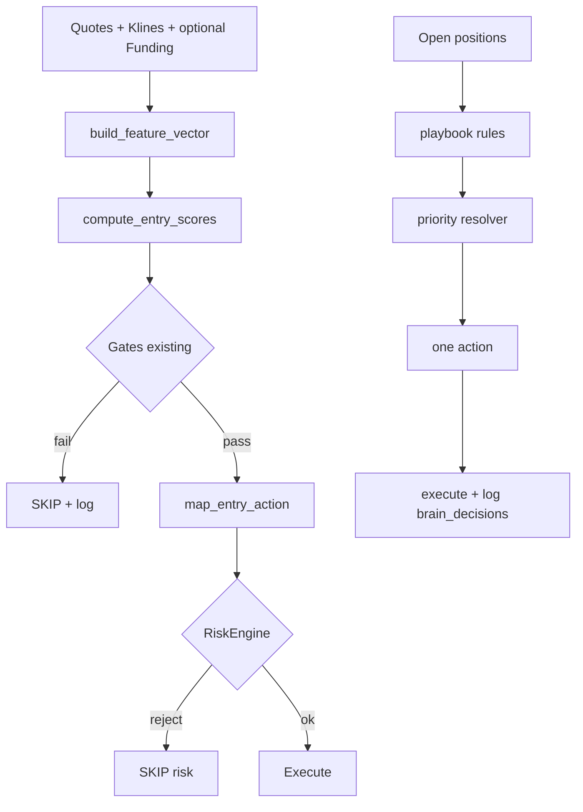

# Expert Trading Brain Spec — Final layer before implementation

**Phiên bản:** 1.0  
**Áp dụng:** `trading-lab-pro-v3`  
**Tiền đề:** Đọc kèm `expert-decision-behavior-framework.md`, `expert-checklist-upgrade-roadmap.md`.

**Nguyên tắc:** Mọi bước dưới đây là **deterministic (rule-based)** trừ mục §3.3 (LLM). Output phải **log + replay + explain** bằng struct cố định.

---

## 0. Kiến trúc tích hợp code (điểm neo)

| Thành phần mới (đề xuất) | Vị trí đặt file | Gọi từ |
|--------------------------|-----------------|--------|
| `BrainFeatureVector` + tính scores | `core/brain/features.py` | `SimulationCycle.run`, `review_positions_and_act` |
| `DecisionScoringEngine` | `core/brain/scoring.py` | Sau khi có quotes + klines + optional funding |
| `BrainActionResolver` (map score + playbook) | `core/brain/actions.py` | Cùng chỗ trên |
| `BrainDecisionRecord` persist | `core/brain/models.py` + DB | Mỗi cycle / mỗi position tick |
| Config weights + thresholds | `config/brain.v1.json` | Load 1 lần/cycle hoặc cache TTL |

**Luồng:** `Market data` → `build_feature_vector()` → `compute_decision_scores()` → `resolve_entry_action()` / `resolve_management_action()` → `log_brain_decision()` → executor hiện có (không thay thế `RiskEngine`, chỉ thêm lớp **gợi ý hành động** và `reason_code` thống nhất).

---

## PHẦN 1 — DECISION SCORING ENGINE

### 1.1 Input (Knows) — chuẩn hóa định lượng

Tất cả giá trị **bắt buộc** nằm trong `[0, 1]` trừ các biến ghi chú.

#### 1.1.1 `trend_strength_score`

**Input:** `klines_1h` dạng `list[Kline1h]` length ≥ `L` (mặc định `L=24`).  
**Logic:**

1. `closes[i] = klines_1h[i].close`  
2. `ret = (closes[-1] - closes[0]) / max(closes[0], ε)`  
3. `norm = clamp(ret / R_trend_cap, -1, 1)` với `R_trend_cap` từ config (mặc định `0.08` = 8% / 24h)  
4. `trend_strength_score = (norm + 1) / 2`  

**Hướng:** `trend_sign = sign(ret) ∈ {-1,0,1}` (dùng cho long/short alignment).

#### 1.1.2 `regime_clarity`

**Input:** `regime_token` (string enum), `regime_market` (string enum từ BTC snapshot — cùng hàm `derive_regime` hoặc map tương đương).  
**Logic:**

```
if regime_token == regime_market: clarity = 1.0
elif {token, market} == {"high_momentum", "balanced"} or {"risk_off", "balanced"}: clarity = 0.65
else: clarity = 0.35
```

(Có thể thay bảng trong `config/brain.v1.json` → `regime_clarity_matrix`.)

#### 1.1.3 `momentum_score`

**Input:** `change_24h_pct` (từ quote), `volume_24h`.  
**Logic:**

1. `m_raw = clamp(change_24h_pct / mom_cap, -1, 1)` — `mom_cap` mặc định `15`  
2. `momentum_score = (m_raw + 1) / 2`

#### 1.1.4 `volatility_score`

**Input:** `klines_1h` length ≥ `N+1` (mặc định `N=14`).  
**Logic:**

1. `tr[i] = max(high,low) range của nến i`  
2. `ATR = mean(tr[-N:])`  
3. `vol_ratio = ATR / max(close[-1], ε)`  
4. `volatility_score = clamp(vol_ratio / vol_ratio_cap, 0, 1)` — `vol_ratio_cap` mặc định `0.04` (4% giá)

#### 1.1.5 `reversal_risk_score`

**Input:** `klines_1h` (≥6 nến), `extension_score` nếu có từ signal (0–1), không có thì tính proxy:  
`ext = abs(close[-1] - min(low[-6:])) / max(high[-6:] - min(low[-6:]), ε)` cho long (đối xứng cho short).  
**Logic:**

1. `vol_drop = 1 - clamp(rel_volume_score, 0, 1)` (dùng 1.1.11)  
2. `ext_risk = clamp(ext * 1.2, 0, 1)`  
3. `reversal_risk_score = clamp(0.45 * ext_risk + 0.35 * vol_drop + 0.2 * volatility_score, 0, 1)`

#### 1.1.6 `distance_to_tp_R` (không scale 0–1)

**Input:** `price`, `take_profit`, `entry`, `stop`, `side`.  
`risk_R = abs(entry - stop)` (USD distance per unit * qty không cần — dùng **giá**):

- Long: `dist_price = take_profit - price`  
- Short: `dist_price = price - take_profit`  
`distance_to_tp_R = dist_price / max(abs(entry - stop), ε)`  
Nếu TP vô lý: fallback `999`.

#### 1.1.7 `unrealized_R`

`unrealized_pnl_usd / max(risk_usd_at_entry, ε)` — lấy `risk_usd` từ trade mở hoặc từ `abs(entry-stop)*qty` quy USD.

#### 1.1.8 `portfolio_exposure`

`open_notional_usd_sum / max(portfolio_exposure_cap_usd, ε)` → clamp `[0,1]`.  
`open_notional_usd_sum` = sum trên vị thế mở `|price*qty|` (hoặc mark từ DB).

#### 1.1.9 `btc_context_score`

**Input:** BTC `change_24h_btc`, `volume_24h_btc` — `derive_regime` → map:

| regime_market | btc_context_score |
|---------------|-------------------|
| high_momentum | 0.85 |
| balanced | 0.5 |
| risk_off | 0.15 |

#### 1.1.10 `funding_rate_signal`

**Input:** `funding_rate` (mỗi 8h, số thập phân như 0.0001). Nếu **không có** → dùng `0.5` (trung tính) và `funding_stale=true` trong log.  
**Logic:**

```
x = clamp(funding_rate / funding_cap, -1, 1)   # funding_cap mặc định 0.0005
funding_rate_signal = (x + 1) / 2
```

Ý nghĩa: funding dương cực đoan → gần 1 (crowded long) → **giảm** attract long (áp vào composite ở §1.2).

#### 1.1.11 `relative_volume_score`

**Input:** `klines_1h` length ≥ 21.  
`rel_vol = volume[-1] / median(volume[-21:-1])`  
`relative_volume_score = clamp(log(1 + rel_vol) / log(1 + rel_vol_cap), 0, 1)` — `rel_vol_cap` mặc định `3.0`.

---

### 1.2 Decision Score — công thức tổng hợp (weighted + điều chỉnh xung đột)

**Config:** `config/brain.v1.json`

```json
{
  "weights": {
    "trend": 0.22,
    "regime_clarity": 0.18,
    "momentum": 0.15,
    "btc_context": 0.15,
    "relative_volume": 0.10,
    "funding": 0.05,
    "reversal_penalty": 0.15
  },
  "funding_long_bias": -0.08,
  "exposure_penalty_per_unit": 0.25,
  "reversal_soft_cap": 0.55,
  "reversal_hard_cap": 0.80
}
```

**Bước 1 — exposure-adjusted components (chỉ dùng cho entry composite):**

```
exposure_headroom = clamp(1 - portfolio_exposure, 0, 1)
```

**Bước 2 — funding bias (chỉ khi hướng LONG được xét):**

```
funding_adj = funding_rate_signal * 0 + (funding_rate_signal - 0.5) * funding_long_bias
```
(Lưu ý: `funding_long_bias` âm → funding cao làm giảm điểm long.)

**Bước 3 — reversal conflict resolution:**

```
if reversal_risk_score >= reversal_hard_cap:
    trend_effective = trend_strength_score * (1 - reversal_risk_score)
else if reversal_risk_score >= reversal_soft_cap:
    trend_effective = trend_strength_score * (1 - 0.5 * (reversal_risk_score - reversal_soft_cap))
else:
    trend_effective = trend_strength_score
```

**Bước 4 — composite entry score (một số cho “chất lượng vào lệnh” theo hướng đã chọn):**

```
base = (
  w_trend * trend_effective
+ w_regime * regime_clarity
+ w_mom * momentum_score
+ w_btc * btc_context_score
+ w_rv * relative_volume_score
+ w_fund * funding_rate_signal
)
penalty_rev = w_rev_penalty * reversal_risk_score
penalty_exp = exposure_penalty_per_unit * portfolio_exposure

decision_score_long = clamp(base + funding_adj - penalty_rev - penalty_exp, 0, 1)

decision_score_short = clamp(
  w_trend * trend_effective_short
+ w_regime * regime_clarity
+ w_mom * (1 - momentum_score)
+ w_btc * (1 - btc_context_score)
+ w_rv * relative_volume_score
+ w_fund * (1 - funding_rate_signal)
- penalty_rev - penalty_exp,
0, 1)
```

`trend_effective_short` = cùng công thức reversal nhưng `trend_strength_score` tính từ **xu hướng giảm** (dùng `-ret` trong 1.1.1 rồi map về 0–1).

**Pseudo code:**

```python
def compute_entry_decision_score(direction: str, fv: FeatureVector, cfg: BrainConfig) -> float:
    te = effective_trend(fv.trend_strength_score, fv.reversal_risk_score, cfg)
    pen_r = cfg.weights.reversal_penalty * fv.reversal_risk_score
    pen_e = cfg.exposure_penalty_per_unit * fv.portfolio_exposure
    if direction == "long":
        base = weighted_sum_long(fv, te, cfg.weights)
        fund = (fv.funding_rate_signal - 0.5) * cfg.funding_long_bias
        return clamp(base + fund - pen_r - pen_e, 0, 1)
    ...
```

---

### 1.3 Action mapping (entry & quản trị — tách hai lớp)

#### 1.3.1 Entry layer (sau strategy đã có signal hướng)

**Input:** `direction ∈ {long, short}`, `decision_score_*`, `regime_clarity`, `btc_context_score`, `reversal_risk_score`, gates hiện có (combo/context/timing) đã pass.

**Thresholds (config `entry_thresholds`):**

```json
{
  "enter_min_score": 0.58,
  "skip_below": 0.45,
  "btc_risk_off_max_long": 0.25,
  "min_regime_clarity_enter": 0.30,
  "max_reversal_enter": 0.75
}
```

**Deterministic mapping:**

| Điều kiện (AND) | Action | `no_trade_reason` / `reason_code` |
|-----------------|--------|-------------------------------------|
| `gates_failed` | `SKIP` | từ gate hiện hữu (không đổi) |
| `direction==long` AND `btc_context_score <= btc_risk_off_max_long` | `SKIP` | `BTC_RISK_OFF` |
| `regime_clarity < min_regime_clarity_enter` | `SKIP` | `LOW_REGIME_CLARITY` |
| `reversal_risk_score > max_reversal_enter` | `SKIP` | `REVERSAL_RISK_HIGH` |
| `decision_score_dir >= enter_min_score` | `ENTER_LONG` hoặc `ENTER_SHORT` | `BRAIN_SCORE_OK` |
| `decision_score_dir < skip_below` | `SKIP` | `BRAIN_SCORE_LOW` |
| else | `SKIP` | `BRAIN_SCORE_MARGINAL` |

**Conflict đã xử lý:** reversal vs trend tại §1.2; BTC risk-off **cứng** chặn long trước score.

#### 1.3.2 Management layer (vị thế đang mở)

Dùng **playbook §2** trước; `Brain` chỉ gán `management_action` + `priority_rank`.  
Mapping tổng hợp sang enum:

- `HOLD`, `REDUCE`, `EXIT`, `PARTIAL_TP`, `TRAIL_STOP`, `SCALE_IN`  
(`ENTER_*` không dùng ở đây.)

---

### 1.4 Decision Priority System — **một hành động duy nhất** mỗi lần gọi

**Hàm:** `resolve_single_management_action(candidates: list[Candidate]) -> Candidate`

**Thứ tự ưu tiên cố định (số nhỏ = chạy trước):**

| Priority | Action | Ghi chú |
|----------|--------|---------|
| 1 | `EXIT` | thesis invalidated, regime force, kill switch |
| 2 | `REDUCE` | exposure hoặc thesis weak |
| 3 | `PARTIAL_TP` | đạt ngưỡng R / gần TP |
| 4 | `TRAIL_STOP` | bật trail sau khi đã lãi đủ |
| 5 | `SCALE_IN` | chỉ khi lãi + trend mạnh + exposure OK |
| 6 | `HOLD` | mặc định |

**Pseudo:**

```python
def pick_one(actions: list[tuple[int, str, dict]]) -> tuple[str, dict]:
    # actions: (priority, name, meta)
    return sorted(actions, key=lambda x: x[0])[0][1:]
```

Nếu hai rule cùng priority → tie-break: higher `|unrealized_R|` wins; nếu vẫn hòa → `EXIT` > `REDUCE` (không xảy ra nếu chỉ một rule fire mỗi priority).

**Mỗi cycle:** tối đa **một** `management_action` được thực thi per `position_id` (trừ partial+trail nếu product yêu cầu — mặc định spec này: **một** action; partial và trail không cùng tick — trail tick sau).

---

## PHẦN 2 — TACTICAL PLAYBOOKS (IF → THEN)

Tất cả điều kiện dùng **Knows** đã định nghĩa §1.1 + `thesis_state`, `regime_shift_flag`.

### 2.1 Losing position playbook

**Biến:** `thesis_state ∈ {VALID, WEAK, INVALID}`, `regime_shift_flag ∈ {0,1}`.

**Gán `thesis_state` (deterministic, trước playbook):**

```
if invalidation_rule_fired: thesis_state = INVALID
else if reversal_risk_score >= 0.72 and unrealized_R <= 0: thesis_state = WEAK
else if price beyond soft_buffer beyond SL side without hitting SL: thesis_state = WEAK
else: thesis_state = VALID
```

(`invalidation_rule_fired` = evaluate predicate lưu trong `TradeDecision` envelope — implement sau.)

| Case | IF | THEN | reason_code |
|------|----|------|-------------|
| 1 Thesis valid | `thesis_state==VALID` AND `regime_shift_flag==0` AND `unrealized_R > -0.35` | `HOLD` | `LOSING_HOLD_THESIS_OK` |
| 1b | `thesis_state==VALID` AND `unrealized_R <= -0.35` AND `volatility_score > 0.75` | `REDUCE` fraction `f=0.35` | `LOSING_REDUCE_NOISE` |
| 2 Thesis weak | `thesis_state==WEAK` | `REDUCE` `f=0.5` OR `TRAIL_STOP` tighten (move SL closer by `k * ATR`, k=0.5 config) | `LOSING_WEAK_REDUCE_OR_TIGHTEN` |
| 3 Thesis invalid | `thesis_state==INVALID` | `EXIT` | `LOSING_THESIS_INVALID` |
| 4 Regime shift | `regime_shift_flag==1` | `EXIT` (ưu tiên) hoặc `HEDGE_PARTIAL` nếu `hedge_allowed==true` | `REGIME_SHIFT_EXIT` / `REGIME_SHIFT_HEDGE` |

`regime_shift_flag = 1` IF `(regime_market_at_entry != regime_market_now) AND regime_clarity >= 0.65`.

---

### 2.2 Winning position playbook

**Tham số config `win_playbook.json` (gộp vào brain.v1):**

```json
{
  "partial_at_R": [[1.0, 0.25], [2.0, 0.35]],
  "trail_arm_R": 1.0,
  "scale_in_min_R": 1.2,
  "scale_in_max_reversal": 0.45,
  "near_tp_R": 0.35
}
```

| IF | THEN | reason_code |
|----|------|-------------|
| `0 <= unrealized_R < 0.5` AND `trend_strength_score < 0.45` | `HOLD` | `WIN_HOLD_EARLY` |
| `0.5 <= unrealized_R < 1` AND `trend_strength_score >= 0.55` | `HOLD` | `WIN_HOLD_BUILDING` |
| `unrealized_R >= 1` AND chưa partial AND match `partial_at_R` | `PARTIAL_TP` với fraction cấu hình | `WIN_PARTIAL_R` |
| `distance_to_tp_R <= near_tp_R` AND `unrealized_R > 0.8` | `PARTIAL_TP` `f=0.4` | `WIN_PARTIAL_NEAR_TP` |
| `unrealized_R >= trail_arm_R` AND `reversal_risk_score < 0.5` AND chưa trailing | `TRAIL_STOP` | `WIN_TRAIL_ARM` |
| `unrealized_R >= scale_in_min_R` AND `trend_strength_score >= 0.7` AND `reversal_risk_score <= scale_in_max_reversal` AND `portfolio_exposure < 0.85` | `SCALE_IN` | `WIN_SCALE_IN` |
| `trend_strength_score < 0.35` AND `unrealized_R >= 0.4` | `REDUCE` `f=0.3` | `WIN_REDUCE_WEAK_TREND` |
| `unrealized_R > 3` AND `reversal_risk_score > 0.65` | `PARTIAL_TP` `f=0.5` | `WIN_PARTIAL_DEEP_PROFIT` |

Áp **§1.4** để chọn một action.

---

### 2.3 No trade playbook

| IF | THEN | `no_trade_reason` |
|----|------|-------------------|
| `regime_clarity < 0.30` | `SKIP` | `LOW_CLARITY` |
| `long_signal AND short_signal` cùng symbol strength chênh < 0.08 | `SKIP` | `CONFLICTING_SIGNALS` |
| `volatility_score > 0.92` AND `relative_volume_score < 0.25` | `SKIP` | `HIGH_NOISE_LOW_PARTICIPATION` |
| `btc_context_score <= 0.25` AND direction long | `SKIP` | `BTC_RISK_OFF` |
| `brain decision_score < skip_below` | `SKIP` | `BRAIN_SCORE_LOW` |

---

### 2.4 Overtrading prevention

| Rule | Implement |
|------|-----------|
| Max trades per cycle | `opens_this_cycle < max_new_positions_per_cycle` (config, mặc định 1) |
| Cooldown | `now - last_entry_ts(symbol) >= entry_cooldown_seconds` (đã có file cooldown — tái sử dụng) |
| Correlation | Gọi `correlation_guard_rejects_fast_entry` **trước** khi gán `ENTER_*` |

---

## PHẦN 3 — AUTONOMY BOUNDARY

### 3.1 Được tự quyết (deterministic runtime)

- Phát sinh `ENTER_*` / `SKIP` / `HOLD` / `EXIT` / `REDUCE` / `PARTIAL_TP` / `TRAIL_STOP` / `SCALE_IN` **theo spec này + config đã load**.
- Gọi execution backend hiện có khi action được risk engine chấp nhận.
- Ghi `brain_decision_log` đầy đủ.

### 3.2 Không được tự quyết

- Sửa `default_risk_pct`, `max_concurrent_trades`, kill switch ngưỡng, file strategy, weights brain vượt `max_delta` trong JSON.
- Ghi đè trực tiếp `config/*.json` production từ worker.

### 3.3 AI / LLM (optional)

| Được | Không được |
|------|------------|
| `summarize_journal(entries)` → text | Set `ENTER_*` / size |
| `suggest_loss_tags(outcome)` → proposal draft | `exec(open(config))` |
| `nlp_to_proposal_json` → queue | Thay `brain.v1.json` runtime |

LLM output **bắt buộc** qua validator schema JSON; nếu fail → discard.

### 3.4 Proposal System

**Tạo proposal chỉ khi:**

- `supporting_outcome_count >= N_min` (5) **và**
- cùng `pattern_key = (loss_category|win_tag, strategy, regime_bucket)` **và**
- `replay_passed == true` trên cửa sổ cố định.

**Mỗi proposal gồm:**

| Field | Kiểu | Ý nghĩa |
|-------|------|---------|
| `proposal_id` | UUID | |
| `confidence_score` | float 0–1 | `min(1, log1p(n_evidence)/log1p(20)) * replay_quality` |
| `affected_metrics` | JSON | `{ "PF": 1.12, "maxDD": -0.08, "win_rate": 0.48 }` |
| `backtest_simulation` | JSON | `{ "window": "30d", "delta_vs_baseline": {...} }` |
| `config_diff` | JSON Patch | chỉ paths trong whitelist |
| `status` | enum | `pending|approved|rejected` |

---

## PHẦN 4 — REPLAY & VALIDATION

### 4.1 Replay

**Artifact bắt buộc mỗi cycle:** `BrainSnapshotRecord`

| Field | Kiểu |
|-------|------|
| `snapshot_id` | UUID |
| `cycle_ts` | ISO8601 |
| `symbol` | str |
| `feature_vector_json` | JSON (toàn bộ §1.1) |
| `config_hash` | sha256 của `brain.v1.json` merged |
| `inputs_hash` | sha256(klines fingerprints + quotes) |

**Replay procedure:**

```python
def replay_decision(snapshot_id: str) -> BrainDecisionRecord:
    snap = load_brain_snapshot(snapshot_id)
    cfg = load_brain_config_at_hash(snap.config_hash)
    fv = FeatureVector(**snap.feature_vector_json)
    score = compute_entry_decision_score(snap.direction, fv, cfg)
    action = map_entry_action(score, fv, cfg)
    return BrainDecisionRecord(..., replay_of=snapshot_id)
```

So sánh `action` và `decision_score` với bản ghi lịch sử → `replay_match: bool`.

### 4.2 Decision audit (bắt buộc mỗi record)

Struct `BrainDecisionRecord` phải trả lời string sẵn:

```json
{
  "why_enter": "decision_score_long=0.62 >= enter_min; gates OK; BTC not risk-off",
  "why_skip": null,
  "why_exit": null
}
```

### 4.3 Metrics (tính offline batch)

| Metric | Định nghĩa |
|--------|------------|
| `decision_quality_score` | `mean(outcome_R * sign(correct_direction))` trên tập lệnh có brain log; `correct_direction` = lãi thì 1 |
| `follow_plan_score` | Tỉ lệ exit có `exit_reason` khớp `manage_plan` đã lưu lúc vào |
| `edge_realization` | `sum(realized_R) / sum(|planned_R|)` |

---

## SCHEMA — DB / Struct

### Table `brain_snapshots`

| Column | Type |
|--------|------|
| id | UUID PK |
| created_at | datetime |
| cycle_id | str |
| symbol | str |
| portfolio_id | int FK nullable |
| feature_vector_json | TEXT |
| config_hash | str |
| inputs_hash | str |

### Table `brain_decisions`

| Column | Type |
|--------|------|
| id | UUID PK |
| snapshot_id | UUID FK |
| phase | enum `entry|management` |
| action | str |
| decision_score | float |
| reason_code | str |
| why_enter | TEXT |
| why_skip | TEXT |
| why_exit | TEXT |
| priority_used | int |
| replay_of | UUID nullable |

---

## Decision flow (tóm tắt)



---

## File config mẫu (`config/brain.v1.example.json`)

Đặt đầy đủ `weights`, `entry_thresholds`, `win_playbook`, `thesis_rules`, `max_new_positions_per_cycle`, `exposure_cap_usd`.

---

## Checklist implementer

- [ ] `FeatureVector` dataclass + unit tests cho từng biến §1.1  
- [ ] `compute_entry_decision_score` golden tests (vector cố định)  
- [ ] `resolve_single_management_action` priority tests  
- [ ] Wire vào `SimulationCycle` sau strategies, trước risk (entry); trong `review_positions_and_act` (management)  
- [ ] Migration SQLite/Postgres cho 2 bảng  
- [ ] CLI `python -m scripts.replay_brain --snapshot-id ...`

---

*Tài liệu này là spec cuối trước code: mọi thay đổi hành vi phải đổi version `brain.v1` + migration config_hash.*
