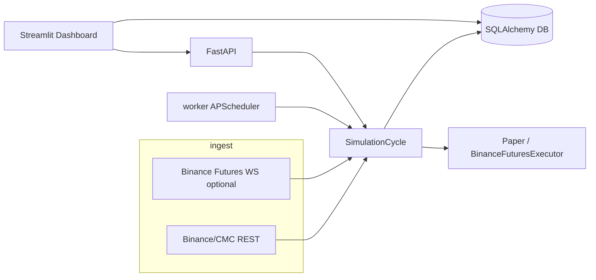

# Trading Lab Pro v3 — Audit hiện trạng (theo `bug/cursor-system-state-checklist.md`)

**Phạm vi:** mã nguồn trong `trading-lab-pro-v3` (đọc source + config + test run cục bộ).  
**Không xác minh:** DB thật đang chạy, log production, UI đang mở trình duyệt, hoặc tài khoản Binance thật — các mục đó ghi **Chưa xác minh runtime môi trường của bạn**.

**Nhãn:** VERIFIED (có bằng chứng trong repo) · PARTIAL (có nhưng chưa end-to-end / phụ thuộc cấu hình) · MISSING (không thấy trong code path) · BROKEN (triển khai lệch kỳ vọng đo được).

---

## 1. Executive summary

v3 là **hệ thống rule-based + orchestration khá dày** quanh một vòng lặp `SimulationCycle`: lấy quote/klines (REST chủ đạo, WS bổ sung khi Binance live), suy luận regime đơn giản từ 24h, chạy nhiều strategy + pipeline lọc (combo edge, context gates, entry timing, regime–strategy filter, correlation guard, capital split), risk engine, rồi paper hoặc Binance Futures. Có **journal + decision log + reflection/review (AI tùy chọn)** nhưng **không có closed-loop tự sửa config/hành vi** đầy đủ.

**Test cục bộ (2026-03-19):** `57 passed, 1 failed` — lỗi `test_klines_cache_key_and_ttl`: test kỳ vọng TTL cũ (`1h`=60, `4h`=300) trong khi `core/market_data/client.py` đặt `1h`=120, `4h`=600 (**BROKEN** giữa test và implementation, không phải lỗi trading logic tự thân).

---

## 2. Kiến trúc runtime hiện tại

| Thành phần | Vai trò | Entry file / lệnh | Nhãn |
|------------|---------|-------------------|------|
| **api** | FastAPI: health, chạy cycle thủ công, metrics, portfolio | `uvicorn apps.api.server:app` — `apps/api/server.py` | VERIFIED |
| **worker** | APScheduler: cycle định kỳ, system review, log monitor, hourly AI situation | `python apps/worker/runner.py` — `apps/worker/runner.py` | VERIFIED |
| **dashboard** | Streamlit: watchlist, cấu hình live/testnet, đọc DB/API | `streamlit run apps/dashboard/app.py` — `apps/dashboard/app.py` | VERIFIED |
| **db (compose)** | Postgres 16 | `docker-compose.yml` service `db` | VERIFIED (trong compose) |
| **redis (compose)** | Redis 7 | `docker-compose.yml` service `redis` | VERIFIED (trong compose) |

**Lệch quan trọng (PARTIAL):** `Settings.database_url` mặc định là `sqlite:///./trading_lab.db` (`core/config.py`). Compose có Postgres nhưng **app chỉ dùng Postgres nếu `.env` set `DATABASE_URL`**. Redis có biến `redis_url` nhưng **không thấy client Redis trong luồng trade** (chỉ script/check) — **MISSING** dùng Redis cho queue/cache trong core.

**Sơ đồ service (logic):**

---

## 3. Luồng dữ liệu và quyết định thật sự

**Chuỗi chính (VERIFIED từ `core/orchestration/cycle.py` + `apps/worker/runner.py`):**

1. **Market data:** `get_quotes_with_fallback` / `get_market_client` — ticker 24h + klines (1h/4h/5m…), cache TTL trong `core/market_data/client.py`.
2. **Regime:** `derive_regime(change_24h, volume_24h)` — `core/regime/detector.py` (ngưỡng cố định, không phải “context engine” đa khung phức tạp).
3. **Signals:** `build_strategy_set()` → từng strategy tạo `StrategySignal`.
4. **Pipeline trước risk:** combo multiplier (`strategy_weight_engine`) → entry context gates → entry timing → chỉnh SL/TP (ATR/cap) — `_apply_entry_edge_pipeline`.
5. **Lọc bổ sung:** regime–strategy order/filter, correlation guard, volatility guard, capital bucket, v.v.
6. **Risk:** `RiskEngine.assess` — concurrent, daily loss %, kill switch R (dashboard), consecutive loss, sizing từ stop distance + risk % (`core/risk/engine.py`).
7. **Action:** `get_execution_backend()` — `PaperExecutionSimulator` hoặc `BinanceFuturesExecutor` (`core/execution/__init__.py`).
8. **Sau lệnh:** journal (`JournalService` + `journal_entries`), trades/positions (`core/portfolio/models.py`), `log_decision` (`core/observability/decision_log.py`).
9. **Cycle tiếp theo:** worker gọi `check_sl_tp_and_close`, `review_positions_and_act`, sync Binance nếu live, rồi `run(...)`.

**Không có bảng `latest_candidates` / `cycle_logs` riêng** trong code đã quét — candidate là **tính toán theo cycle**, không persist như một “ranking store” (**MISSING** so với checklist tưởng tượng).

---

## 4. Checklist hiện trạng theo module

| Mục | Nhận định |
|-----|-----------|
| Docker / compose | VERIFIED |
| API / worker / dashboard entry | VERIFIED |
| Postgres trong compose vs SQLite default | PARTIAL — dễ chạy nhầm file SQLite khi quên env |
| Redis trong luồng trade | MISSING |
| Scheduler cycle | VERIFIED (`BlockingScheduler` + interval `cycle_interval_seconds`) |
| WebSocket feed | PARTIAL — bật khi `BinanceFuturesExecutor` trong worker |
| Live Binance | PARTIAL — `enable_live_binance_futures` + key/secret + override dashboard |
| Testnet/mainnet | VERIFIED — `get_effective_binance_futures_testnet()` / `dashboard_overrides.json` |

---

## 5. Checklist tư duy quyết định (Decision logic)

| Mục | Nhãn | Ghi chú ngắn |
|-----|------|--------------|
| Tạo opportunity | VERIFIED | Signal từ strategies + filter pipeline trong `SimulationCycle.run` |
| Ranking engine tách biệt | MISSING | Không có engine ranking persistent; “ưu tiên” qua filter + thứ tự xử lý |
| `recommended_strategy` | PARTIAL | Chế độ single strategy từ dashboard override |
| Long/short | VERIFIED | `core/strategies/short`, `evaluate_short`, v.v. |
| Thống nhất ranking vs execution | VERIFIED | Cùng một `SimulationCycle` — không có hai engine đối lập |
| Entry evaluate | VERIFIED | Pipeline + risk |
| Regime filter strategy | VERIFIED | `regime_strategy_filter` |
| Cooldown | PARTIAL | Entry cooldown file + scale-in cooldown trong config |
| Confidence | PARTIAL | Trường `confidence` trên `Position`; mức dùng trong toàn bộ gate cần đọc thêm từng chỗ |

---

## 6. Checklist hành động thực tế (Action flow)

| Mục | Nhãn | Ghi chú |
|-----|------|---------|
| Paper engine | VERIFIED | `core/execution/simulator.py` |
| Live Binance | VERIFIED | `core/execution/binance_futures.py` — MARKET + TP/SL algo orders (docstring) |
| Switch paper/live | VERIFIED | `get_execution_backend()` |
| Sync position từ sàn | VERIFIED | `sync_positions_from_binance` gọi từ worker |
| Partial fill / retry | PARTIAL | Cần đọc sâu executor; không audit chi tiết trong phiên này |
| HOLD / trailing / proactive exit | PARTIAL | Settings + `review_positions_and_act`, proactive engines trong `core/profit/` |
| Scale-in | VERIFIED | `ScaleInEngine`, `scale_in.v1.json`, tests |

---

## 7. Checklist học tập / cải thiện / phản tư

| Mục | Nhãn |
|-----|------|
| Journal + MFE/MAE, exit_reason, regime, setup_type | VERIFIED — `core/journal/models.py` |
| Decision log | VERIFIED — `core/observability/decision_log.py` |
| System review / AI situation | VERIFIED — `runner.py` jobs + `core/reflection/` |
| Strategy weights / combo từ lịch sử | VERIFIED — `compute_strategy_weights`, combo multipliers (ảnh hưởng size / chặn entry) |
| Auto tune threshold / auto viết config | MISSING |
| Closed-loop “học rồi tự đổi hành vi” | PARTIAL tối đa — có điều chỉnh động trong cycle nhưng không có pipeline tự cập nhật rule file an toàn |

**Phân loại learning (theo checklist I2):** gần **Human-assisted learning + một phần adaptive trong runtime**; **chưa** closed-loop đầy đủ.

---

## 8. Chênh lệch “kỳ vọng chuyên gia” vs thực tế

| Năng lực kỳ vọng | Hiện trạng v3 | Chênh |
|------------------|---------------|-------|
| Đọc regime thị trường | `derive_regime` 24h + volume | Lớn — thiếu regime đa tầng, cấu trúc thị trường sâu |
| Chọn token xác suất cao | Watchlist + rule/strategy | Trung bình — không có ranking xác suất thống nhất |
| Đồng bộ ranking–execution | Một cycle | Nhỏ |
| Entry đa khung | 1h/4h/5m + timing config | Trung bình — có nhưng không đồng nhất “expert MTF narrative” |
| Risk budget / portfolio | RiskEngine + capital_split + correlation_guard | Trung bình — tốt hơn bot cơ bản, chưa full portfolio-grade |
| Scale-in thông minh | Engine + tests | Trung bình |
| Correlation / sector | `correlation_guard` + config | PARTIAL — phụ thuộc config và dữ liệu |
| Đóng chủ động khi edge yếu | proactive / exit_guards / volatility | PARTIAL |
| Journaling | Journal model đầy đủ field | Nhỏ–trung bình |
| Học để đổi hành vi tương lai | Weights/combo, không auto rule | Lớn |

---

## 9. Danh sách lỗi / thiếu / rủi ro

1. **Test TTL klines lệch code** — `tests/test_market_data_and_errors.py` vs `KLINES_CACHE_TTL` trong `client.py` (**BROKEN**).
2. **Compose Postgres vs SQLite default** — rủi ro triển khai: worker và API có thể không dùng container DB (**PARTIAL risk**).
3. **Redis “có service nhưng không dùng trong core”** — dễ hiểu nhầm là đã có queue (**MISSING**).
4. **Regime quá đơn giản** so với độ phức tạp phần còn lại — edge decision có thể không khớp “ý đồ regime” (**risk logic**).
5. **Không có bảng audit cycle/decision trace trong DB** — trace chủ yếu file/log (**MISSING** so với checklist P0 ideal).

---

## 10. Việc nên làm tiếp theo (P0 / P1 / P2)

### P0 — biết đúng hệ thống đang chạy gì

- Sửa hoặc đồng bộ test `test_klines_cache_key_and_ttl` với TTL thực tế.
- Document rõ: “mặc định SQLite; Postgres chỉ khi `DATABASE_URL`…”.
- Thêm (hoặc xác nhận) một nguồn truth cho **decision trace** (DB hoặc file JSONL có schema cố định) map `signal → risk → order id`.

### P1 — quyết định đúng hơn

- Làm rõ document một trang “thứ tự A→Z” trong `SimulationCycle.run` (đối chiếu checklist D2).
- Cân nhắc regime ric hơn hoặc align đơn giản hóa pipeline để không overshoot so với regime input.

### P2 — học như chuyên gia

- Closed-loop có kiểm soát: đề xuất thay đổi config → human approve → ghi version.
- Backtest/replay chuẩn hóa kết nối với cùng pipeline entry (hiện có `core/backtest/engine.py` — cần verify parity với live trong audit sau).

---

## Phần K — Kết luận dứt khoát (theo checklist)

### K1. Hệ thống hiện tại là gì?

**☑ advanced automated trading system** (gần ranh giới **semi-professional trading lab** nếu bật đủ journal + live + capital split + guards).

*Vì sao:* có nhiều lớp gate, execution thật tùy chọn, journal chi tiết, reflection jobs — nhưng regime/data layer và learning loop chưa “expert OS”.

### K2. Full luồng tư duy?

**☑ có nhưng rời rạc ở mức “nhiều module”** — thống nhất trong một file cycle lớn, không phải một decision engine nhỏ gọn document hóa.

### K3. Full luồng hành động?

**☑ có cho paper trade**; **☑ có cho live** với điều kiện cấu hình (**PARTIAL** “chắc chắn” nếu chưa chạy thực tế trên tài khoản của bạn).

### K4. Full luồng học tập?

**☑ có reflection hỗ trợ con người** + **một phần adaptive sizing/weights**; **☐ closed-loop learning** đầy đủ.

### K5. Tối đa 3 nút thắt

1. **Regime + market context** còn mỏng so với độ phức tạp downstream.  
2. **Observability DB-level** (cycle snapshot, map quyết định) chưa đủ cho vận hành chuyên nghiệp.  
3. **Learning**: thiếu vòng khép kín an toàn từ metrics → thay đổi hành vi được kiểm soát.

---

*Tài liệu được sinh từ audit static trên repo `trading-lab-pro-v3`; cập nhật sau khi có log/runtime thật nên bổ sung mục “VERIFIED runtime”.*
